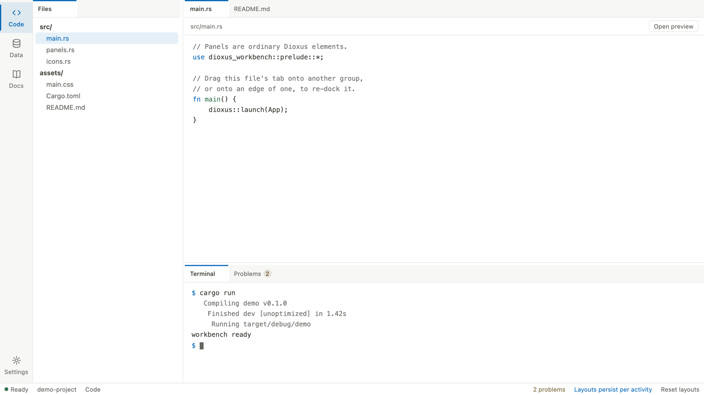

# dioxus-workbench

[](https://github.com/XiangpengHao/dioxus-workbench/actions/workflows/ci.yml)

A dockable panel workbench for [Dioxus](https://dioxuslabs.com). You get the
editor-style shell — tabbed panel groups, drag-to-dock, resizable splits, an
activity rail, and a status bar — as plain Rust components, without paying
the JavaScript cost of an Electron-style stack.

<!-- TODO: capture assets/screenshot.png from the demo and restore the image:
 -->

*The demo app is a small fake IDE with three activities, each keeping its own
persisted layout. Run it with `cd demo && dx serve`.*

## Features

- **Tabbed panel groups** — every group has a tab strip; click to activate,
  drag a tab away to rearrange.
- **Drag-to-dock** — drop a tab on a group's center to attach it as a tab, or
  on an edge to split that group, with live drop previews and a dock compass.
- **Resizable splits** — drag the separator, arrow-key it (Shift for bigger
  steps), or double-click to reset to the initial ratio.
- **Serializable layouts** — the split tree is a small serde value;
  `encode()` it on change, `decode()` it next session, and the workspace
  reconciles it against whatever panels exist by then.
- **Layout reconciliation** — panels that disappear are pruned, panels that
  arrive later (hot-plugged devices, opened documents) join their declared
  home tile, and stale empty groups collapse.
- **Application shell** — `Workbench`, `ActivityRail`, and `StatusBar` wrap
  the workspace in the surrounding chrome; all content stays yours.
- **Keyboard & accessibility** — full tab/tablist/tabpanel semantics, focusable
  separators with ARIA values, `Alt+Shift+Arrow` to split,
  `Alt+Shift+PageUp/PageDown` to move between groups, and
  `prefers-reduced-motion` support.
- **Renderer-agnostic** — no `web-sys`, no JavaScript dependencies; DOM
  measurement and pointer capture go through Dioxus's own document APIs, so
  web and desktop behave the same.
- **Dark mode** out of the box, themable with CSS variables.

## Quickstart

```rust
use dioxus::prelude::*;
use dioxus_workbench::prelude::*;

#[component]
fn App() -> Element {
    let panels = vec![
        Panel::new("files", "Files", "side", rsx! { FileTree {} }),
        Panel::new("editor", "Editor", "main", rsx! { Editor {} }),
        Panel::new("terminal", "Terminal", "bottom", rsx! { Terminal {} }),
    ];
    let layout = PanelLayout::new(LayoutNode::split(
        "root",
        SplitAxis::Horizontal,
        0.25,
        LayoutNode::tile("side", ["files"]),
        LayoutNode::split(
            "main-rows",
            SplitAxis::Vertical,
            0.7,
            LayoutNode::tile("main", ["editor"]),
            LayoutNode::tile("bottom", ["terminal"]),
        ),
    ));

    rsx! {
        div { style: "width: 100vw; height: 100vh;",
            PanelWorkspace { panels, initial_layout: layout }
        }
    }
}
```

The workspace fills its parent, so give the parent a size. The application
owns panel content and the first-open arrangement; the workspace owns every
later dock, tab, and resize.

Panel ids identify content; tile and split ids identify layout positions. All
three should remain stable across releases when persisted layouts need to
survive. A panel's `home` tile is used only when that panel is newly
discovered and absent from a restored layout.

## The shell

`Workbench` frames the workspace with an optional activity rail and status
bar. Both are slots — the library draws the chrome, you say what it means:

```rust
rsx! {
    Workbench {
        rail: rsx! {
            ActivityRail {
                ActivityButton {
                    label: "Code",
                    icon: rsx! { CodeIcon {} },
                    active: activity() == Activity::Code,
                    onclick: move |_| activity.set(Activity::Code),
                }
                ActivityButton { label: "Settings", bottom: true, onclick: move |_| { /* … */ } }
            }
        },
        status: rsx! {
            StatusBar {
                left: rsx! {
                    StatusItem { StatusDot { tone: StatusTone::Good } "Connected" }
                },
                message: rsx! { StatusMessage { "Saved layout" } },
                right: rsx! {
                    StatusItem { tone: StatusTone::Accent, "main · 12:04" }
                },
            }
        },
        PanelWorkspace { panels, initial_layout }
    }
}
```

`ActivityButton { bottom: true }` pins an item (and any after it) to the
rail's end — the conventional place for settings. A `StatusItem` with an
`onclick` renders as a button; without one it is inert text.

## Persistence

Layouts serialize to a compact JSON string. Where it lives is up to you —
local storage, a settings file, a server:

```rust
PanelWorkspace {
    panels,
    initial_layout: saved.unwrap_or_else(|| default_layout.clone()),
    // Splitter double-click resets to the canonical arrangement,
    // not to whatever happened to be saved.
    reset_layout: default_layout,
    on_layout_change: move |layout: PanelLayout| {
        if let Some(encoded) = layout.encode() {
            save_somewhere("workspace-layout", encoded);
        }
    },
}
```

On restore, `PanelLayout::decode` rejects stale or corrupt values, and the
workspace reconciles the decoded tree against the current panel registry:
missing panels are dropped, new panels join their `home` tile, and a panel
built with `.with_home_zone(DockZone::Right)` splits in beside its home
instead of hiding as another tab.

The `layout_scope` prop reloads the layout when the host switches context
(another document, another screen) while the component instance stays
mounted. The demo persists one layout per activity this way.

## Dynamic panels

The `panels` prop is the registry: render it from state and panels come and
go at runtime. A panel built with `.with_closable(true)` gets a close
affordance in its tab; handle `on_panel_close` by removing it from your
registry. Set `active_panel` to bring a panel's tab to the front
programmatically — a notification's "show me" action, for example.

## Theming

Every color and structural size flows through a `--wb-*` variable. Override
them on `.wb-shell` / `.wb-workspace` or any ancestor:

```css
.wb-shell {
  --wb-accent: #10b981;
  --wb-canvas: #fdfdfc;
  --wb-rail-size: 4.5rem;
  /* see dioxus-workbench/src/style.css for the full list */
}
```

Dark mode follows `prefers-color-scheme` automatically. The stylesheet is
compiled into the crate and injected once per tree; if you would rather serve
it yourself, it is exported as `dioxus_workbench::STYLESHEET`.

## Events

| Prop | Fires when |
| --- | --- |
| `on_layout_change` | any layout mutation — docking, resizing, splitting, activating — with the full serializable layout |
| `on_panel_activate` | a panel's tab comes to the front, by pointer, keyboard, drop, or `active_panel` |
| `on_panel_close` | a closable panel's close affordance is used; remove the panel from `panels` to complete it |
| `on_resize` | panel geometry changed, for content that measures its container (canvases, charts) |

## Development

The repo is a workspace: `dioxus-workbench/` is the library, `demo/` is the
demo app. The Nix flake provides everything (Rust with the wasm target, `dx`,
`wasm-opt`); CI runs fmt, clippy, tests, and a wasm check through the same
flake.

```bash
nix develop                        # or direnv
cargo test -p dioxus-workbench
cd demo && dx serve                # http://127.0.0.1:8080
```

For release builds, pass `--debug-symbols false` — the nixpkgs `wasm-opt` is
newer than the one dx pins and crashes on the debug info dx keeps by default:
`dx build --release --debug-symbols false`.

## Roadmap

- Floating panels and maximize-a-group
- Layout presets and a "reset layout" command
- Tab overflow menus for very crowded groups
- Optional tab reordering within a group
